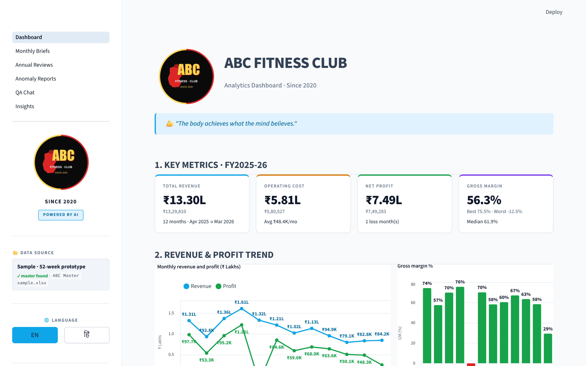
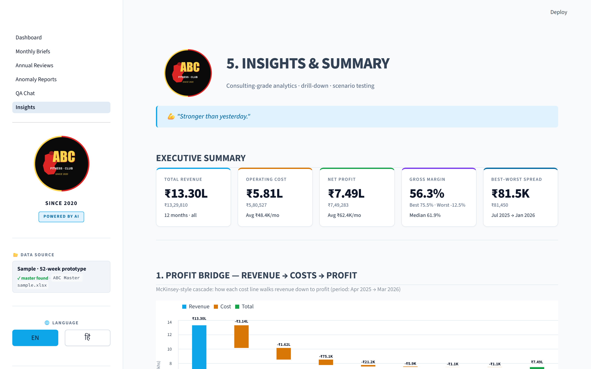
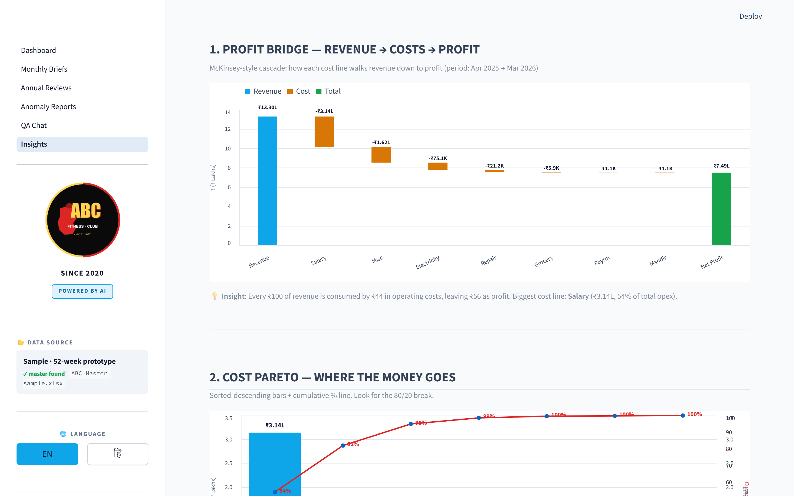
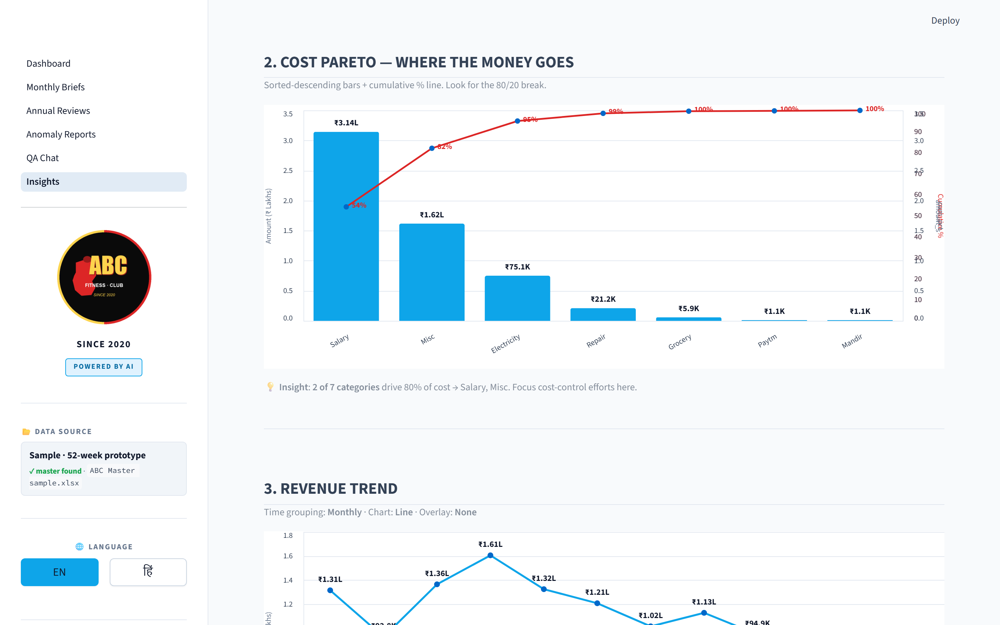
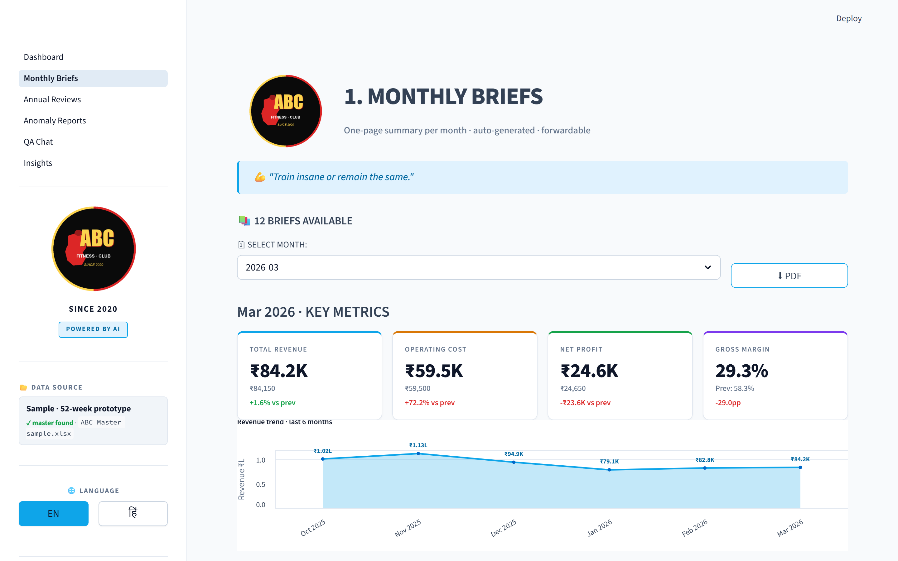
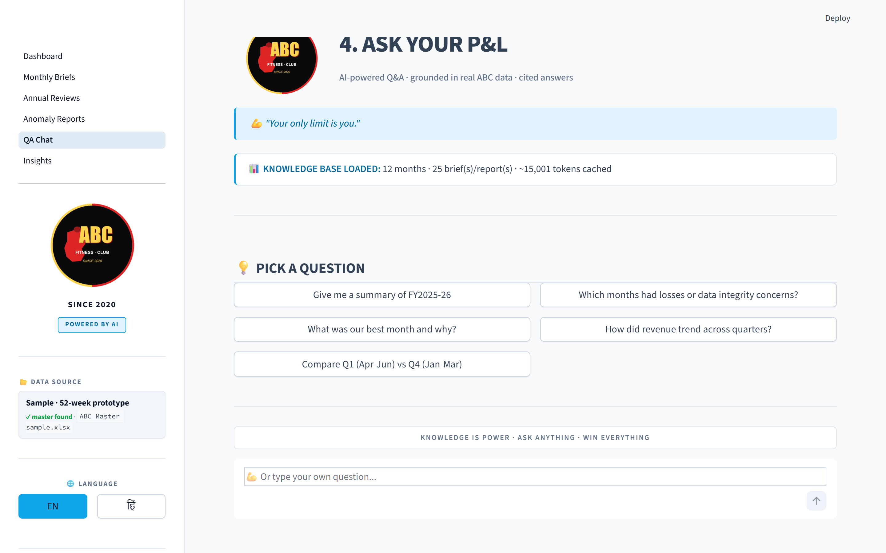

# ABC Analytics — an MBB-grade P&L copilot for small-business fitness centres

> An end-to-end financial-intelligence platform that turns a weekly Excel master into
> consultant-style monthly briefs, anomaly reports, an annual review, and an
> interactive Q&A chat — all powered by Claude Haiku 4.5 and running locally for ~₹10/month.


---

## Why this exists

Small-business owners (a single-location fitness centre, a tuition centre, a clinic) are
drowning in Excel but starving for insight. They have:

- A weekly raw-receipt file that needs ingestion
- A monthly P&L they look at once and forget
- Anomalies (unposted entries, expense spikes, data-entry errors) they catch
  only when an accountant asks at year-end
- Zero budget for Power BI / Tableau / a finance analyst

**ABC Analytics** is the answer: a self-hosted, locally-private analytics
platform with one purpose — *make the owner instantly smarter about their
own numbers*.

---

## What it does (5 modules)

| # | Page | What you get |
|---|------|---|
| 1 | **Monthly Briefs** | One-page, plain-English narratives per month — best line, worst line, what changed, what to investigate. Forwardable to family/partners. PDF export. |
| 2 | **Annual Reviews** | Two versions of every fiscal year: a narrative *Owner version* and a numerical *Accountant version*. PDF export. |
| 3 | **Anomaly Reports** | Rule-based detector (z-score, GM compression, unexpected zeros) → LLM-triage with classification (`data_error_suspected` / `business_event` / `partial_month_artifact` / `needs_investigation`). |
| 4 | **Q&A Chat** | RAG over the master Excel + all generated briefs. Suggests follow-up questions. Exports the conversation to PDF. |
| 5 | **Insights & Summary** | Interactive analytics — Profit Bridge waterfall, Cost Pareto (80/20), MoM Bridge, Run-rate + forecast, Quarterly view, Scenario sliders, 9 consulting callouts. Every chart has on-bar / on-line data labels. |

---

## The "consulting brain" — business-rules layer

The hardest part of this project wasn't the dashboard. It was teaching the LLM
**when *not* to compare**.

A naïve setup says *"May revenue down 49% vs April!"* when really:
1. May is only at day 24 of 31 (77% complete).
2. Salary + electricity haven't been posted yet (they're month-end batch entries).
3. The pace factor projects May at ~₹72K, not a real decline.

`month_context.py` detects all three conditions deterministically and feeds the
LLM a `MONTH STATUS` block. The prompt then has hard-banned phrases
("decline", "drop", "below prior", "softness", etc.) for partial months, and
swaps the "What moved" template for a "Where things stand (to date)" variant.

This is the difference between a script that calls an API and a system that
**reasons like a consultant**.

---

## Architecture

```
┌─────────────────────────┐      ┌─────────────────────┐      ┌──────────────────────┐
│  Weekly raw .xlsx files │─────▶│   Pipeline          │─────▶│   Master.xlsx        │
│  (drop in 1.Ingestion/) │      │   (Excel cleaner +  │      │   P&L · Ultra ·      │
└─────────────────────────┘      │    SLV-layer build) │      │   Premium · Recon …  │
                                  └─────────────────────┘      └──────────┬───────────┘
                                                                          │
                                  ┌─────────────────────────────┐         │
                                  │  Data layer                 │◀────────┘
                                  │  pnl_reader · membership_*  │
                                  └──────────┬──────────────────┘
                                             │
                  ┌──────────────────────────┼──────────────────────────┐
                  ▼                          ▼                          ▼
        ┌──────────────────┐       ┌────────────────────┐    ┌──────────────────────┐
        │  Rule layer      │       │  Context layer     │    │  Analysis layer      │
        │  - month_context │       │  - qa_context      │    │  - analyzer          │
        │  - anomaly_detect│       │    (RAG retriever) │    │  - year_analyzer     │
        └────────┬─────────┘       └──────────┬─────────┘    └──────────┬───────────┘
                 │                            │                         │
                 └─────────────┬──────────────┴─────────────┬───────────┘
                               ▼                            ▼
                  ┌──────────────────────────┐    ┌──────────────────────┐
                  │  LLM layer               │    │  Streamlit UI        │
                  │  Claude Haiku 4.5        │───▶│  6 pages · EN/HI     │
                  │  + prompt caching        │    │  + PDF export        │
                  │  + structured output     │    │  + Altair charts     │
                  └──────────────────────────┘    └──────────────────────┘
```

See [`docs/ARCHITECTURE.md`](docs/ARCHITECTURE.md) for the deep dive.

---

## Deep-dive docs

Designed to be readable both as study material and as a forwardable artifact for teammates, recruiters, or stakeholders.

| Doc | What's inside | Pages |
|---|---|---|
| 📘 [Project Components Reference](docs/Project_Components_Reference.pdf) | Every layer, every file, every non-obvious technique used. Interview-ready talking points. Ready-to-copy resume + LinkedIn + X pitches. | 18 |
| 📗 [Lakehouse Migration Guide](docs/Lakehouse_Migration_Guide.pdf) | Self-study guide on migrating this architecture to Azure Databricks + Unity Catalog + ADLS Gen2 following the medallion pattern. Covers cost reality, risks, and a glossary of 25 terms. | 21 |
| 📐 [Architecture deep-dive](docs/ARCHITECTURE.md) | Layered design, file-map, three non-obvious design choices, Streamlit-specific patterns. | — |
| 🚀 [Deploy to Streamlit Community Cloud](docs/DEPLOY_STREAMLIT_CLOUD.md) | Step-by-step from `git push` to public live demo URL. | — |

---

## Tech stack

| Layer | Tool | Why |
|---|---|---|
| Data | Excel (openpyxl) | The owner already uses Excel — no migration needed |
| Pipeline | Python | Reads weekly raws, builds SLV/Gold layers, maintains reconciliation |
| LLM | **Claude Haiku 4.5** | Best quality-per-rupee for short narrative tasks |
| Prompting | **Prompt caching + structured output (JSON schema)** | 80% cost reduction on repeat Q&A |
| UI | **Streamlit** | One-file pages, fast iteration, Indian-data-friendly |
| Charts | **Altair (Vega-Lite)** | Declarative, dark/light theme, data labels on every series |
| PDF | **ReportLab** | Pure Python (no LaTeX, no wkhtmltopdf), brand-aligned reports |
| i18n | Custom `t()` helper | EN + Hindi bilingual UI |

---

## Screenshots

| Home | Insights |
|---|---|
|  |  |
| **Profit Bridge (Waterfall)** | **Cost Pareto** |
|  |  |
| **Monthly Brief (partial month aware)** | **Q&A Chat** |
|  |  |

*Replace these PNGs in `docs/screenshots/` with your own — they're committed
as placeholders.*

---

## Quick start (3 minutes)

```bash
# 1. Clone
git clone https://github.com/ravmak2017/abc-analytics.git
cd abc-analytics

# 2. Install
pip install -r requirements.txt

# 3. Add your API key (free signup at https://console.anthropic.com)
cp .env.example .env
# … then edit .env and paste your key

# 4. Launch
streamlit run Dashboard.py
```

Open <http://localhost:8501>. The dashboard ships with a sanitized 52-week
sample dataset and pre-generated AI reports, so you see the full product on
the first click — no API call needed for browsing.

To regenerate the AI content against the sample data:
```bash
python narrate_month.py            # latest month
python sentinel.py --all           # all anomaly scans
python narrate_year.py             # annual owner + accountant
```

Each regeneration costs <₹2 in total tokens (Haiku 4.5).

---

## Live demo

If a deployed instance is up, you'll find it here:
<https://your-streamlit-app.streamlit.app>

(See [`docs/DEPLOY_STREAMLIT_CLOUD.md`](docs/DEPLOY_STREAMLIT_CLOUD.md) to
launch your own in ~10 minutes.)

---

## Data & privacy

- The repo ships **only synthetic data**. The sample master Excel under
  `sample_data/` has all names anonymized to `Member 0001` etc. and locations
  bucketed into `Branch A–H`. Financial figures were already synthetic.
- The original production deployment uses real data that **never leaves the
  owner's machine**. The pipeline reads local Excel files, the LLM API call
  is the only thing that touches the network, and even those API requests
  contain only **monthly aggregates** (no member names, no transaction-level
  detail).
- A `.gitignore` blocks `*.real.xlsx`, `real_data/`, `.env`, and Streamlit
  secrets from ever being pushed.

---

## Cost

Operating cost for a real single-location fitness centre (the original deployment):

| Item | Monthly |
|---|---|
| Hosting (Cloudflare Tunnel → local PC) | ₹0 |
| Anthropic API (12 briefs + 12 anomaly + 1 annual + occasional Q&A) | ~₹5–10 |
| **Total** | **~₹10** |

---

## Roadmap

- [ ] Multi-tenant SaaS (per-fitness centre tenant, single dashboard URL)
- [ ] Cloudflare Access SSO out of the box
- [ ] WhatsApp delivery of monthly brief PDF
- [ ] Auto-cron via Windows Task Scheduler / systemd timer

---

## License

[MIT](LICENSE).

---

**License:** MIT — see [LICENSE](LICENSE).
**Stack:** Python 3.12 · Streamlit · Anthropic Claude Haiku 4.5 · Altair · ReportLab · openpyxl.
**Status:** Production deployment at a single-location fitness centre; the public repository
ships with sanitized 52-week sample data and pre-generated AI artifacts so the full product is
explorable without an API key.
